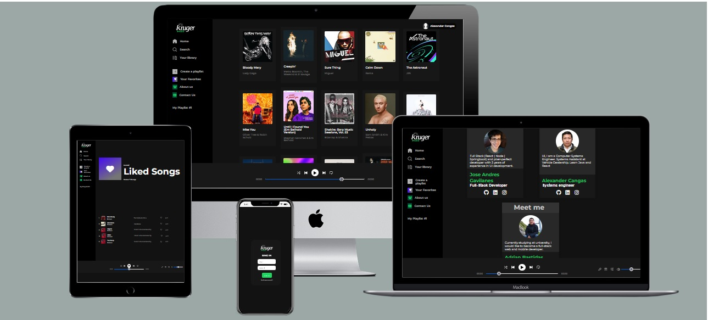

<br />
<div align="center">
  <a href="https://github.com">
    
  </a>

  <h1 align="center">Kruger Music (Spotify clone)</h1>


<a href="JS" target="_blank"></a>
<a href="HTML" target="_blank"></a>
<a href="SASS" target="_blank"></a>

<h4 align="center">

  
# 💻 Live Demo


###	🚧 Status: Building 🚀  🚧
###  [Deploy](https://spotify-rose-one.vercel.app/)


### [Video of functionality - Spanish ](https://youtu.be/wD6KHWzMumc)

</h4>

---

  <p align="center">
    Your favorite music all in one app
    <br />
    <br />
    <a href="https://github.com/joseandresgavilanes/spotify/issues">View Demo</a>
    ·
    <a href="https://github.com/joseandresgavilanes/spotify/issues">Report Bug</a>
    ·
    <a href="https://github.com/joseandresgavilanes/spotify/issues">Request Feature</a>
  </p>
</div>

<!-- TABLE OF CONTENTS -->

<br/>
<details>
  <summary>Table of Contents</summary>
  <ol>
    <li>
      <a href="#🎶-about-the-project">About The Project</a>
      <ul>
        <li><a href="#🔨-built-with">Built with</a></li>
      </ul>
    </li>
    <li>
      <a href="#🤸-getting-started">Getting Started</a>
      <ul>
        <li><a href="#💾-installation">Installation</a></li>
      </ul>
    </li>
    <li><a href="#⏩-usage">Usage</a></li>
    <li><a href="#🗺-roadmap">Roadmap</a></li>
    <li><a href="#🙌-contributing">Contributing</a></li>
    <li><a href="#📜-license">License</a></li>
    <li><a href="#📫-contact">Contact</a></li>
    <li><a href="#ℹ️-acknowledgments">Acknowledgments</a></li>
  </ol>
</details>

<!-- ABOUT THE PROJECT -->

<hr/>
<br/>

# 🎶 About The Project
This is an application designed to accompany you in your daily life.
Here you can at first glance see the TOP songs worldwide and your own songs
<br>



### What can you do?

- You can search for any music or song, whether by artist, genre, country. 🎵🌎🎺🎤 🇪🇨
- Create your username and password with the characteristics for an artist.
   - In addition to having your favorite songs in the playlist, you can also put your own songs to create your own Album.
     🤵🎵🎧💃🕺🎶

# 🔨 Built with

- 
- 
- 
- <a href="JS" target="_blank"></a>
- <a href="HTML" target="_blank"></a>
- <a href="SASS" target="_blank"></a>
- 
- 

<!-- GETTING STARTED -->

# 🤸 Getting Started

It's necessary to have git 😺 and node in your computer and an account in RAPID API!


### 👨‍💻❗ Log in

```bash
# EMAIL
$ pepe@gmail.com
# PASSWORD
$ pepe1233456
```


### 💾 🗄️ Installation

```bash
# Clone Repository
$ git clone https://github.com/joseandresgavilanes/spotify
# Go to server folder
$ cd spotify
# Install Dependencies
$ npm i
# Run Aplication with create react app
$ npm start
```

```bash
# .ENV variables
$ add your shazamCore KEY
```

<!-- USAGE EXAMPLES -->
<br/>

# ⏩ Usage
- Create an account: ✍🏼
  [![Product usage Screen Shot][usage2-screenshot]]

- Log in with your user account 🗝️

- Enjoy your favorite music 🎵 ᴺᴼᵂ ᴾᴸᴬᵞᴵᴺᴳ♫♬♪

- In your Account edit your information 📝

- Create your playlist 📋 ▶️ 🎵

- Create your own Musical album 📀
<!-- ROADMAP -->
<br/>

# 🗺 Roadmap

- [x] Select Theme of our application
- [x] Find APIs that suit our ideas
- [x] Check what information the API gives us
- [x] Brainstorm ideas for functionality and execution objectives.
- [x] FRONTEND FUNCTIONALITY:
   - [x] Decide Visual Model to implement
   - [x] Work methodology on Github
   - [x] Folder Structure within the Application
   - [x] Appointment standardization
         components and classes within the html
   - [x] Component generation with the Sazham Core API
     - [x] Show Global Songs
     - [x] Search Component
     - [x] Custom Playlist
- [x] BACKEND FUNCTIONALITY:
   - [x] Select database
   - [x] Api implementation with Springboot
   - [x] Deploy and publish custom API for CRUD

<!-- CONTRIBUTING -->
<br/>

# 🙌 Contributing

Contributions are what make the open source community such an amazing place to be learn, inspire, and create. Any contributions you make are **greatly appreciated**.

1. Fork the Project
2. Create your Feature Branch (`git checkout -b feature/AmazingFeature`)
3. Commit your Changes (`git commit -m 'Add some AmazingFeature'`)
4. Push to the Branch (`git push origin feature/AmazingFeature`)
5. Open a Pull Request

<br/>

<!-- LICENSE -->

# 📜 License

Kruger music esa distribuida bajo los terminos de Apache License Version 2.0. La version completa de la licencia esta disponible en el archivo [LICENSE](LICENSE) de este repositorio. Cualquier contribucion a este proyecto sera licenciada bajo la licencia Apache License Version 2.0.

<br/>
<!-- CONTACT -->

# 📫 Contact


<sub><b>José Andrés Gavilanes - Smiley</b></sub>
<br />

[![linkedin][linkedin.js]][linkedin2-url] [![github][github.js]][github-url]

<hr/>


<sub><b>Adrian Bastidas</b></sub>
<br />

[![linkedin][linkedin.js]][linkedin2-url] [![github][github.js]][github2-url]

<hr/>


<sub><b>Alexander Cangas</b></sub>
<br />

[![linkedin][linkedin.js]][linkedin3-url] [![github][github.js]][github3-url]

<hr/>

Project Link: [Kruger Music](https://google.com)

Demostration Link: [Kruger Music](https://google.com)

<!-- ACKNOWLEDGMENTS -->

<br/>

# ℹ️ Acknowledgments

<table>
    <tbody>
        <tr>
        <td align="center"><a href="https://github.com/Adrian-Bastidas"><br /><sub><b>Adrian Bastidas</b></sub></a><br /><a href="https://github.com/Adrian-Bastidas" title="Code">💻 Developer</a></td>
        <tr/>
        <br/>
        <tr>
        <td align="center"><a href="https://github.com/xander06"><br /><sub><b>Alexander Cangas</b></sub></a><br /><a href="https://github.com/xander06" title="Code">💻 Developer</a></td>
        </tr>
        <br/>
        <tr>
        <td align="center"><a href="https://github.com/joseandresgavilanes"><br /><sub><b>Jose Andres Gavilanes</b></sub></a><br /><a href="https://github.com/joseandresgavilanes" title="Code">💻 Developer</a></td>
        </tr>
        <br/>
        <tr>
            <td align="center"><a href="https://github.com/Juanse7793"><br /><sub><b>Juan Sebastian Sotomayor</b></sub></a><br /><a href="https://github.com/Juanse7793" title="Code">FrontEnd Kruger Mentor</a></td>
        </tr>
    </tbody>
</table>

[linkedin.js]: https://img.shields.io/badge/-LinkedIn-1C82AD?logo=LinkedIn
[linkedin-url]: www.linkedin.com/in/david-lozada471
[linkedin2-url]: https://www.linkedin.com/search/results/all/?heroEntityKey=urn%3Ali%3Afsd_profile%3AACoAAC7ePl0BFj6WkCWQGsQqwEgPGrrp8Kzpe7s&keywords=adrian%20rafael%20bastidas%20moya&origin=RICH_QUERY_SUGGESTION&position=0&searchId=a944fdbf-5a03-4a71-8a32-11a700849fc3&sid=b%40k
[linkedin3-url]: https://www.linkedin.com/in/alexander-c-00a2967b/
[github.js]: https://img.shields.io/badge/-GitHub-181717?logo=GitHub
[github-url]: https://github.com/joseandresgavilanes
[github2-url]: https://github.com/Adrian-Bastidas
[github3-url]: https://github.com/xander06
